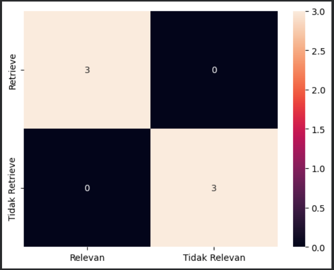

# Document Retrieval with Cosine Similarity

This project implements an Information Retrieval system using the Cosine Similarity algorithm on Indonesian language documents with comprehensive text preprocessing.

---

## 📊 Retrieval Results

### Confusion Matrix - Model Evaluation



_The confusion matrix shows the model's performance in classifying documents based on the determined threshold._

---

## 📋 Data and Preprocessing Results

### 1. Initial Documents

| ID  | Document Content                                                                                                                                                                             |
| --- | -------------------------------------------------------------------------------------------------------------------------------------------------------------------------------------------- |
| d1  | Unitama lecturers are holding a coordination meeting for lecturers in the Unitama campus auditorium.                                                                                         |
| d2  | Pasnur is one of the lecturers at Unitama Makassar campus.                                                                                                                                   |
| d3  | How close are the lecturers and students at Unitama campus?                                                                                                                                  |
| d4  | Makassar city is the largest city in South Sulawesi and is designated as a world city.                                                                                                       |
| d5  | Let me introduce myself, Muhammad Bintang Ramli, I come from Makassar City, Sudiang Village, I Like Reading Books, And Learning Coding 😁👍.                                                 |
| d6  | I feel that the information retrieval system course is quite interesting to learn, and I hope here I will gain a lot of knowledge because I really like STKI (information retrieval system). |
| q   | **Unitama Makassar Lecturers** (Query)                                                                                                                                                       |

**Explanation:** The table above shows 6 documents along with the query that will be used for search. The query is "Unitama Makassar Lecturers" which will be searched for similarity with each document using cosine similarity.

---

### 2. Case Folding & Filtering Results

| ID  | Preprocessing Result                                                                                                 |
| --- | -------------------------------------------------------------------------------------------------------------------- |
| d1  | unitama lecturers holding coordination meeting lecturers auditorium unitama campus                                   |
| d2  | pasnur lecturer unitama makassar campus                                                                              |
| d3  | close lecturers lecturers students students unitama campus                                                           |
| d4  | makassar city largest city south sulawesi designated world city                                                      |
| d5  | introduce name muhammad bintang ramli come makassar city sudiang village like read book learn coding                 |
| d6  | feel course information retrieval system interesting learn hope knowledge lot like stki information retrieval system |

**Explanation:** This stage performs case folding (converting all text to lowercase) and filtering (removing special characters/numbers). The result is normalized text ready for the next stage.

---

### 3. Stopword Removal Results

| ID  | Stopword Removal Result                                                                                              |
| --- | -------------------------------------------------------------------------------------------------------------------- |
| d1  | lecturers lecturers unitama meeting coordination lecturers auditorium campus unitama                                 |
| d2  | pasnur lecturers campus unitama makassar                                                                             |
| d3  | close lecturers lecturers students students campus unitama                                                           |
| d4  | makassar city largest city south sulawesi designated world city                                                      |
| d5  | introduce name muhammad bintang ramli come makassar city sudiang village like read book learn coding                 |
| d6  | feel course information retrieval system interesting learn hope knowledge lot like stki information retrieval system |

**Explanation:** Stopword removal eliminates common words that are not meaningful (such as "and", "in", "I", "from", etc.). This process leaves only words that have high informative value.

---

### 4. Stemming Results (Final Preprocessing Stage)

| ID  | Stemming Result                                                                                  |
| --- | ------------------------------------------------------------------------------------------------ |
| d1  | lectur lectur unitama meet coordinat lectur auditor campus unitama                               |
| d2  | pasnur lectur campus unitama makassar                                                            |
| d3  | close lectur lectur student student campus unitama                                               |
| d4  | makassar city largest city south sulawesi designat world city                                    |
| d5  | introduc name muhammad bintang ramli come makassar city sudiang village like read book learn cod |
| d6  | feel course inform retriev system interest learn hope knowledg lot like stki inform retriev      |

**Explanation:** Stemming converts words to their root form (root form). For example "lecturers" becomes "lectur", "reading" becomes "read", etc. This helps reduce dimensionality and improve search relevance.

---

## 🔍 Cosine Similarity Retrieval Results

| No  | Document ID | Cosine Similarity | Prediction | Actual | Status |
| --- | ----------- | ----------------- | ---------- | ------ | ------ |
| 1   | d1          | 0.9036            | 1          | 1      | ✅ TP  |
| 2   | d2          | 0.8539            | 1          | 1      | ✅ TP  |
| 3   | d3          | 0.7696            | 1          | 1      | ✅ TP  |
| 4   | d4          | 0.1453            | 0          | 0      | ✅ TN  |
| 5   | d5          | 0.0856            | 0          | 0      | ✅ TN  |
| 6   | d6          | 0.1624            | 0          | 0      | ✅ TN  |

**Explanation:** This table shows the results of calculating cosine similarity between the query "Unitama Makassar Lecturers" with each document. The "Prediction" column uses a threshold of 0.2 (documents with similarity ≥ 0.2 are classified as relevant). The results show that d1, d2, and d3 have high similarity and are considered relevant because they discuss the topic of lecturers at Unitama Makassar.

---

## 📈 Model Evaluation

| Metric              | Value       |
| ------------------- | ----------- |
| True Positive (TP)  | 3           |
| False Positive (FP) | 0           |
| False Negative (FN) | 0           |
| True Negative (TN)  | 3           |
| **Precision**       | 1.00 (100%) |
| **Recall**          | 1.00 (100%) |
| **F1-Score**        | 1.00 (100%) |
| **Accuracy**        | 1.00 (100%) |

**Explanation:** The evaluation results show perfect model performance. All relevant documents were successfully identified (Recall = 100%) without any false positives (Precision = 100%). This means the system successfully performed retrieval without classification errors.

---

## 📝 Methodology Description

### Text Preprocessing Pipeline

This system uses a comprehensive text preprocessing pipeline to clean and normalize documents before the retrieval process:

1. **Case Folding**: Converting all text to lowercase to ensure consistency and avoid word duplication that differs only in capitalization.

2. **Filtering**: Removing irrelevant characters such as symbols, numbers, and punctuation marks. Only keeping alphabetic letters and spaces.

3. **Stopword Removal**: Removing common words (stopwords) such as "and", "in", "I", "which", etc. that do not significantly contribute to document meaning. Uses the Sastrawi library for Indonesian language stopword removal.

4. **Stemming**: Converting inflected words to their root form. For example "reading", "has read" becomes "read". This reduces vocabulary size and improves model generalization. Also uses the Sastrawi library for Indonesian language stemming.

### Cosine Similarity Algorithm

After preprocessing, the system uses TF-IDF (Term Frequency-Inverse Document Frequency) to represent documents as vectors. Cosine similarity is then calculated as:

**cos(θ) = (A · B) / (||A|| × ||B||)**

where:

- A is the vector of the query
- B is the vector of the document
- A · B is the dot product
- ||A|| and ||B|| are the magnitude/norm of the vectors

Similarity ranges from 0 to 1, where 1 indicates perfect similarity and 0 indicates no similarity at all.

### Performance Evaluation

The model is evaluated using:

- **Precision**: Proportion of documents predicted as relevant that are actually relevant
- **Recall**: Proportion of relevant documents successfully identified by the system
- **F1-Score**: Harmonic mean between precision and recall
- **Accuracy**: Proportion of correct predictions out of total predictions

In this case, a threshold of 0.2 is chosen for relevant/not relevant classification.

---

## 🛠️ Technologies Used

- **Python 3.x**
- **Pandas**: Data manipulation and analysis
- **Scikit-learn**: TF-IDF vectorization and matrix computation
- **NumPy**: Numerical operations and linear algebra
- **Sastrawi**: Stemming and stopword removal for Indonesian language
- **Matplotlib & Seaborn**: Results visualization (confusion matrix)

---

## 📂 File Structure

```
cosine-similarity-retrieval/
├── README.md                           # Project documentation (Indonesian)
├── README_EN.md                        # Project documentation (English)
├── RETRIEVAL-RESULT.ipynb             # Notebook with complete implementation
├── RETRIEVAL-RESULT-EXCEL-VERSION.xlsx # Retrieval results in Excel format
├── result-image/
│   └── confusion-matrix.png           # Confusion matrix visualization
└── .git/                              # Version control
```

---

## 👤 Author

**Muhammad Bintang Ramli**

- From: Makassar, South Sulawesi
- Village: Sudiang
- Interests: Reading Books, Learning Coding, and Information Retrieval Systems (STKI)
